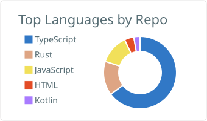

## Hi there 👋

A fat man who is losing weight.

A geek, a lifelong learner.

> Great projects only had a few people at first

Hangzhou. I write TypeScript and Rust, and I keep notes on [my blog](https://wsafight.github.io/personBlog/).

**Now**

- [gpui-rsx](https://github.com/wsafight/gpui-rsx) — JSX-like syntax for GPUI
- [personBlog](https://wsafight.github.io/personBlog/) — notes from work, reading, and building
- [business-util](https://wsafight.github.io/business-util/) — practical frontend utilities

### GitHub Stats

  
  

  
  

